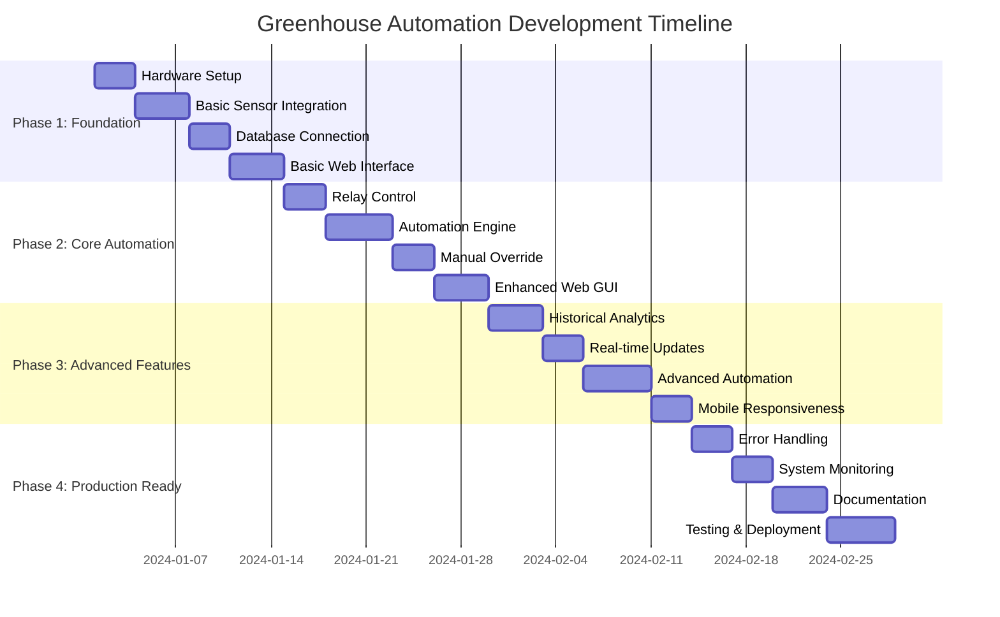

# Development Roadmap & Implementation Timeline

## Project Phases Overview

This project is divided into 4 main phases, each building upon the previous one to create a complete greenhouse automation system.

## Phase 1: Foundation (Week 1-2)

### Goal: Establish basic data collection and storage

#### 1.1 Hardware Setup & System Configuration
**Duration: 3 days**
- [ ] Install Raspberry Pi OS and configure basic settings
- [ ] Enable I2C interface and install required packages
- [ ] Connect all sensors to I2C bus
- [ ] Connect relay module to GPIO pins
- [ ] Test all hardware connections
- [ ] Create backup of system image

**Deliverables:**
- Working Raspberry Pi with all sensors connected
- I2C device detection showing all sensors
- Basic relay control test successful

#### 1.2 Basic Sensor Integration
**Duration: 4 days**
- [ ] Implement base sensor class
- [ ] Create individual sensor drivers (MCP9808, TSL2591X, Si7021, AHT20)
- [ ] Develop sensor manager for coordinated readings
- [ ] Implement error handling and retry logic
- [ ] Create sensor data validation
- [ ] Add logging for sensor operations

**Deliverables:**
- Sensor reading scripts returning structured data
- Error handling for sensor failures
- Logging system for debugging

#### 1.3 Database Connection & Storage
**Duration: 3 days**
- [ ] Set up MySQL database on remote server
- [ ] Create database schema and tables
- [ ] Implement database connection pool
- [ ] Create data models with SQLAlchemy
- [ ] Develop data repository layer
- [ ] Test data insertion and retrieval

**Deliverables:**
- Remote MySQL database with proper schema
- Working database connection from Raspberry Pi
- Data storage and retrieval functionality

#### 1.4 Basic Web Interface
**Duration: 4 days**
- [ ] Set up Flask/FastAPI application
- [ ] Create basic API endpoints for sensor data
- [ ] Develop simple web dashboard
- [ ] Implement real-time data display
- [ ] Add basic styling and layout
- [ ] Test web interface functionality

**Deliverables:**
- Working web API serving sensor data
- Basic dashboard showing current readings
- Responsive web interface

## Phase 2: Core Automation (Week 3-4)

### Goal: Implement device control and basic automation

#### 2.1 Relay Control System
**Duration: 3 days**
- [ ] Implement relay controller class
- [ ] Add safety features and error handling
- [ ] Create device state management
- [ ] Implement emergency shutdown
- [ ] Add relay status monitoring
- [ ] Test relay control functionality

**Deliverables:**
- Reliable relay control system
- Safety mechanisms for device operation
- Device status monitoring

#### 2.2 Automation Engine
**Duration: 5 days**
- [ ] Design rule-based automation system
- [ ] Implement threshold-based control
- [ ] Add time-based scheduling
- [ ] Create rule configuration management
- [ ] Develop rule evaluation engine
- [ ] Test automation logic

**Deliverables:**
- Working automation engine
- Configurable rules system
- Threshold and time-based control

#### 2.3 Manual Override System
**Duration: 3 days**
- [ ] Implement manual control interface
- [ ] Add override timeout functionality
- [ ] Create override status tracking
- [ ] Develop web interface for manual control
- [ ] Add confirmation dialogs for safety
- [ ] Test manual override features

**Deliverables:**
- Manual control system
- Override timeout mechanisms
- Web interface for manual operation

#### 2.4 Enhanced Web GUI
**Duration: 4 days**
- [ ] Improve dashboard design
- [ ] Add device control panels
- [ ] Implement status indicators
- [ ] Create configuration interface
- [ ] Add responsive design
- [ ] Test enhanced interface

**Deliverables:**
- Professional web interface
- Device control panels
- Configuration management

## Phase 3: Advanced Features (Week 5-6)

### Goal: Add analytics, real-time updates, and advanced automation

#### 3.1 Historical Analytics
**Duration: 4 days**
- [ ] Implement data aggregation queries
- [ ] Create chart visualization components
- [ ] Add time range selection
- [ ] Develop data export functionality
- [ ] Create analytics dashboard
- [ ] Test historical data features

**Deliverables:**
- Historical data visualization
- Analytics dashboard
- Data export capabilities

#### 3.2 Real-time Updates
**Duration: 3 days**
- [ ] Implement WebSocket connections
- [ ] Add real-time data streaming
- [ ] Create live status updates
- [ ] Implement connection management
- [ ] Add reconnection logic
- [ ] Test real-time functionality

**Deliverables:**
- WebSocket-based real-time updates
- Live data streaming
- Connection management

#### 3.3 Advanced Automation
**Duration: 5 days**
- [ ] Implement complex rule logic
- [ ] Add seasonal automation patterns
- [ ] Create learning algorithms
- [ ] Develop predictive control
- [ ] Add automation performance metrics
- [ ] Test advanced automation

**Deliverables:**
- Complex automation rules
- Seasonal control patterns
- Performance monitoring

#### 3.4 Mobile Responsiveness
**Duration: 3 days**
- [ ] Optimize interface for mobile devices
- [ ] Add touch-friendly controls
- [ ] Implement mobile-specific features
- [ ] Test on various devices
- [ ] Optimize performance
- [ ] Deploy mobile-ready interface

**Deliverables:**
- Mobile-responsive interface
- Touch-optimized controls
- Cross-device compatibility

## Phase 4: Production Ready (Week 7-8)

### Goal: Ensure system reliability and maintainability

#### 4.1 Comprehensive Error Handling
**Duration: 3 days**
- [ ] Implement global exception handling
- [ ] Add retry mechanisms for failures
- [ ] Create error logging and alerting
- [ ] Develop recovery procedures
- [ ] Add system health checks
- [ ] Test error scenarios

**Deliverables:**
- Robust error handling
- System recovery mechanisms
- Health monitoring

#### 4.2 System Monitoring
**Duration: 3 days**
- [ ] Implement performance monitoring
- [ ] Add resource usage tracking
- [ ] Create alerting system
- [ ] Develop monitoring dashboard
- [ ] Add log analysis tools
- [ ] Test monitoring features

**Deliverables:**
- System monitoring dashboard
- Performance metrics
- Alerting system

#### 4.3 Documentation & Deployment
**Duration: 4 days**
- [ ] Create installation guide
- [ ] Write user documentation
- [ ] Develop maintenance procedures
- [ ] Create troubleshooting guide
- [ ] Prepare deployment scripts
- [ ] Test documentation accuracy

**Deliverables:**
- Complete documentation set
- Installation and maintenance guides
- Deployment automation

#### 4.4 Testing & Quality Assurance
**Duration: 5 days**
- [ ] Implement unit tests
- [ ] Create integration tests
- [ ] Perform load testing
- [ ] Conduct security testing
- [ ] Run user acceptance testing
- [ ] Fix identified issues

**Deliverables:**
- Comprehensive test suite
- Performance benchmarks
- Security validation

## Risk Assessment & Mitigation

### Technical Risks
1. **Sensor Communication Issues**
   - Risk: I2C bus conflicts or sensor failures
   - Mitigation: Implement robust error handling and fallback mechanisms

2. **Database Connectivity**
   - Risk: Network issues affecting remote database
   - Mitigation: Add local caching and retry logic

3. **Power Supply Problems**
   - Risk: Insufficient power for all components
   - Mitigation: Calculate power requirements and use adequate supply

### Operational Risks
1. **Hardware Failures**
   - Risk: Relay or sensor failures affecting automation
   - Mitigation: Implement redundancy and monitoring

2. **Software Bugs**
   - Risk: Code issues causing system instability
   - Mitigation: Comprehensive testing and gradual rollout

## Success Criteria

### Phase 1 Success
- All sensors reading data accurately
- Data stored reliably in remote database
- Basic web interface displaying current readings

### Phase 2 Success
- Reliable device control via relays
- Working automation based on sensor thresholds
- Manual override functionality operational

### Phase 3 Success
- Historical data visualization working
- Real-time updates functioning
- Advanced automation rules operational

### Phase 4 Success
- System running reliably 24/7
- Comprehensive monitoring and alerting
- Complete documentation and deployment ready

## Next Steps

After completing this roadmap, the system will be ready for production use. Future enhancements could include:
- Machine learning for optimization
- Integration with weather services
- Mobile app development
- Multi-greenhouse support
- Advanced analytics and reporting