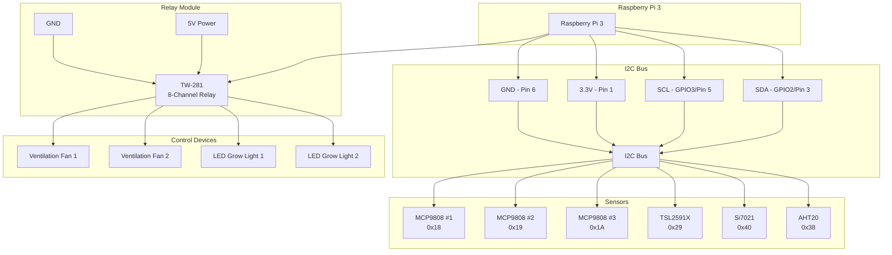

# Hardware Setup Guide

## Sensor Specifications and I2C Addresses

### Temperature Sensors
- **MCP9808** (Multiple units)
  - Temperature range: -40°C to +125°C
  - Accuracy: ±0.5°C (typical)
  - Resolution: 0.0625°C
  - I2C Address: 0x18 (default) - configurable via pins
  - Voltage: 2.7V to 5.5V

### Light Sensor
- **TSL2591X**
  - Light range: 188 μLux to 88,000 Lux
  - Resolution: 16-bit effective
  - I2C Address: 0x29 (fixed)
  - Voltage: 3.3V to 5V

### Temperature/Humidity Sensors
- **Si7021**
  - Temperature: -10°C to +85°C (±0.4°C)
  - Humidity: 0% to 100% RH (±3%)
  - I2C Address: 0x40 (fixed)
  - Voltage: 1.9V to 3.6V

- **AHT20 (STEMMA QT)**
  - Temperature: -40°C to +85°C (±0.5°C)
  - Humidity: 0% to 100% RH (±2%)
  - I2C Address: 0x38 (fixed)
  - Voltage: 2.0V to 5.5V

## Raspberry Pi 3 GPIO Pinout

```
     3V3  (1) (2)  5V
   GPIO2  (3) (4)  5V
   GPIO3  (5) (6)  GND
   GPIO4  (7) (8)  GPIO14
     GND  (9) (10) GPIO15
  GPIO17 (11) (12) GPIO18
  GPIO27 (13) (14) GND
  GPIO22 (15) (16) GPIO23
     3V3 (17) (18) GPIO24
  GPIO10 (19) (20) GND
   GPIO9 (21) (22) GPIO25
  GPIO11 (23) (24) GPIO8
     GND (25) (26) GPIO7
   GPIO0 (27) (28) GPIO1
   GPIO5 (29) (30) GND
   GPIO6 (31) (32) GPIO12
  GPIO13 (33) (34) GND
  GPIO19 (35) (36) GPIO16
  GPIO26 (37) (38) GPIO20
     GND (39) (40) GPIO21
```

## I2C Bus Configuration

### I2C Connections
- **SDA (Data)**: GPIO2 (Pin 3)
- **SCL (Clock)**: GPIO3 (Pin 5)
- **3.3V Power**: Pin 1 or Pin 17
- **Ground**: Pin 6, 9, 14, 20, 25, 30, 34, or 39

### Multiple MCP9808 Address Configuration
The MCP9808 allows address configuration via A0, A1, A2 pins:
- Default: 0x18 (A0=0, A1=0, A2=0)
- Available addresses: 0x18 to 0x1F (8 possible addresses)

## Relay Module (TW-281) Connections

### Relay Control Pins
```
Relay 1 → GPIO17 (Pin 11)
Relay 2 → GPIO18 (Pin 12)
Relay 3 → GPIO27 (Pin 13)
Relay 4 → GPIO22 (Pin 15)
Relay 5 → GPIO23 (Pin 16)
Relay 6 → GPIO24 (Pin 18)
Relay 7 → GPIO25 (Pin 22)
Relay 8 → GPIO12 (Pin 32)
```

### Relay Module Power
- **VCC**: 5V (Pin 2 or 4)
- **GND**: Ground (Pin 6, 9, 14, etc.)
- **Input**: 3.3V compatible (Raspberry Pi GPIO)

## Wiring Diagram



## Detailed Wiring Steps

### Step 1: I2C Sensor Setup
1. Connect all sensors to the I2C bus in parallel
2. Use a breadboard or custom PCB for clean connections
3. Add pull-up resistors (4.7kΩ) if not built-in to sensors
4. Configure MCP9808 addresses by setting A0/A1/A2 pins

### Step 2: Relay Module Connection
1. Connect VCC to 5V power (Pin 2 or 4)
2. Connect GND to ground (Pin 6, 9, 14, etc.)
3. Connect IN1-IN8 to designated GPIO pins
4. Ensure relay module is compatible with 3.3V logic

### Step 3: Power Considerations
- Use separate power supply for high-power devices (fans, LEDs)
- Add opto-isolators if needed for electrical isolation
- Include fuses for safety protection
- Consider power requirements of all components

## Raspberry Pi Configuration

### Enable I2C Interface
```bash
# Run Raspberry Pi configuration
sudo raspi-config

# Navigate to: Interface Options → I2C → Enable
# Reboot when prompted
```

### Install Required Packages
```bash
# Update system
sudo apt update && sudo apt upgrade -y

# Install I2C tools
sudo apt install -y i2c-tools python3-smbus

# Install GPIO library
pip3 install RPi.GPIO

# Install sensor libraries
pip3 install adafruit-circuitpython-mcp9808
pip3 install adafruit-circuitpython-tsl2591
pip3 install adafruit-circuitpython-si7021
pip3 install adafruit-circuitpython-ahtx0
```

### Test I2C Devices
```bash
# Scan I2C bus for connected devices
sudo i2cdetect -y 1

# Expected output should show:
# 0x18, 0x19, 0x1A (MCP9808 sensors)
# 0x29 (TSL2591X)
# 0x38 (AHT20)
# 0x40 (Si7021)
```

## Physical Installation Tips

### Sensor Placement
- Place temperature sensors at different heights for gradient monitoring
- Position light sensor at plant canopy level
- Ensure humidity sensors are away from direct water spray
- Consider airflow patterns for representative readings

### Relay Module Safety
- Use proper enclosures for high-voltage connections
- Label all relay connections clearly
- Include emergency stop functionality
- Follow local electrical codes and regulations

### Cable Management
- Use appropriate gauge wires for current requirements
- Secure cables to prevent accidental disconnection
- Use strain relief for connector stress
- Label cables for easy troubleshooting

## Troubleshooting

### Common I2C Issues
- **No devices detected**: Check connections, power, and I2C enable
- **Address conflicts**: Verify MCP9808 address configuration
- **Intermittent readings**: Check for loose connections or noise

### Relay Issues
- **Relays not activating**: Verify GPIO configuration and power
- **Relays chattering**: Check power supply stability
- **Back EMF issues**: Add flyback diodes for inductive loads

### Power Issues
- **Brownouts**: Use adequate power supply for all components
- **Voltage drops**: Check wire gauge and connection quality
- **Noise issues**: Add decoupling capacitors if needed