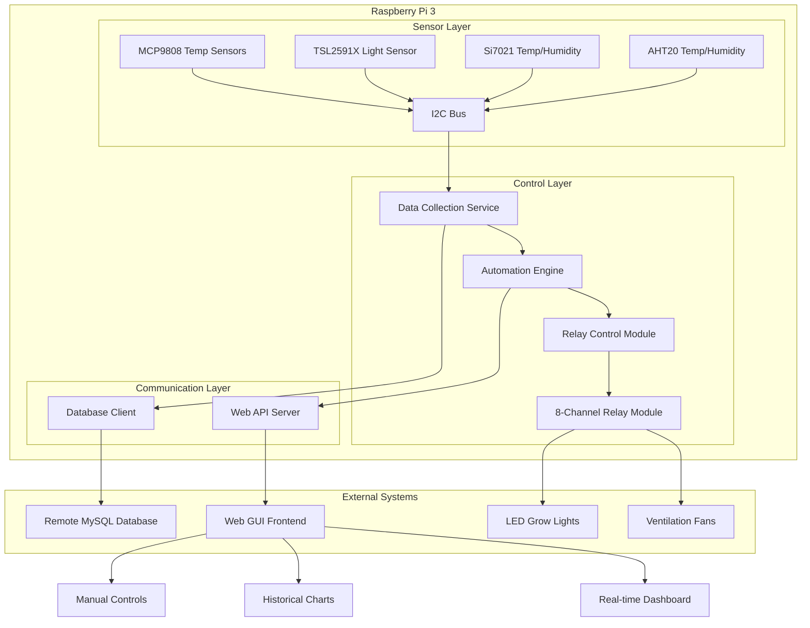

# Greenhouse Sensor Data Collector - Project Architecture

## Overview
This project transforms a Raspberry Pi 3 into an intelligent greenhouse automation system that monitors environmental conditions and controls ventilation/LED systems based on sensor data and configurable parameters.

## Hardware Components

### Sensors
- **Multiple MCP9808** - I2C temperature sensors (±0.5°C accuracy)
- **TSL2591X** - I2C light intensity sensor (high dynamic range)
- **Si7021** - I2C temperature and humidity sensor
- **STEMMA QT AHT20** - I2C temperature and humidity sensor

### Control Hardware
- **8-Channel Relay Module (TW-281)** - For switching ventilation fans and LED grow lights
- **Raspberry Pi 3** - Main controller with I2C communication and GPIO control

## System Architecture



## Software Architecture

### Core Components

1. **Sensor Data Collection Service**
   - Python-based service running as systemd daemon
   - Polls all sensors via I2C at configurable intervals
   - Handles sensor errors and data validation
   - Implements data smoothing and outlier detection

2. **Automation Engine**
   - Rule-based control system for ventilation and LEDs
   - Configurable thresholds and schedules
   - Manual override capabilities
   - Seasonal adjustment support

3. **Database Layer**
   - MySQL client for remote data storage
   - Connection pooling and retry logic
   - Data compression for efficient storage
   - Backup and recovery mechanisms

4. **Web API Server**
   - RESTful API for data access and control
   - WebSocket support for real-time updates
   - Authentication and security measures
   - Rate limiting and request validation

5. **Web GUI Frontend**
   - Responsive web interface
   - Real-time data visualization
   - Historical data charts and analytics
   - Manual control interface

## Database Schema Design

### Tables Structure

```sql
-- Sensor readings storage
CREATE TABLE sensor_readings (
    id BIGINT PRIMARY KEY AUTO_INCREMENT,
    timestamp DATETIME(3) NOT NULL,
    sensor_id VARCHAR(50) NOT NULL,
    sensor_type ENUM('temperature', 'humidity', 'light') NOT NULL,
    value DECIMAL(10,4) NOT NULL,
    unit VARCHAR(10) NOT NULL,
    location VARCHAR(50),
    INDEX idx_timestamp (timestamp),
    INDEX idx_sensor_type (sensor_type, timestamp)
);

-- Control events logging
CREATE TABLE control_events (
    id BIGINT PRIMARY KEY AUTO_INCREMENT,
    timestamp DATETIME(3) NOT NULL,
    device_type ENUM('ventilation', 'led') NOT NULL,
    device_id INT NOT NULL,
    action ENUM('on', 'off') NOT NULL,
    trigger_source ENUM('automation', 'manual', 'schedule') NOT NULL,
    trigger_value VARCHAR(100),
    INDEX idx_device_time (device_type, timestamp)
);

-- System configuration
CREATE TABLE system_config (
    id INT PRIMARY KEY AUTO_INCREMENT,
    config_key VARCHAR(100) UNIQUE NOT NULL,
    config_value TEXT NOT NULL,
    description TEXT,
    updated_at TIMESTAMP DEFAULT CURRENT_TIMESTAMP ON UPDATE CURRENT_TIMESTAMP
);

-- Automation rules
CREATE TABLE automation_rules (
    id INT PRIMARY KEY AUTO_INCREMENT,
    rule_name VARCHAR(100) NOT NULL,
    device_type ENUM('ventilation', 'led') NOT NULL,
    condition_type ENUM('threshold', 'schedule', 'complex') NOT NULL,
    conditions JSON NOT NULL,
    is_active BOOLEAN DEFAULT TRUE,
    created_at TIMESTAMP DEFAULT CURRENT_TIMESTAMP
);
```

## Technology Stack

### Backend
- **Python 3.9+** - Main programming language
- **Flask/FastAPI** - Web framework for API
- **SQLAlchemy** - Database ORM
- **PyMySQL** - MySQL database connector
- **RPi.GPIO** - GPIO control for relays
- **smbus2** - I2C communication
- **APScheduler** - Task scheduling

### Frontend
- **HTML5/CSS3/JavaScript** - Web interface
- **Chart.js** - Data visualization
- **WebSocket** - Real-time updates
- **Bootstrap** - Responsive design

### System
- **systemd** - Service management
- **nginx** - Reverse proxy (optional)
- **SQLite** - Local caching and configuration

## Development Phases

### Phase 1: Foundation (Current Focus)
- Basic sensor data collection
- Simple relay control
- Database connectivity
- Basic web interface

### Phase 2: Automation
- Rule-based automation engine
- Manual override functionality
- Enhanced web GUI with controls
- Historical data visualization

### Phase 3: Advanced Features
- Seasonal automation patterns
- Advanced analytics and reporting
- Mobile app support
- Integration with external weather data

## Security Considerations

- Database connection encryption
- API authentication and authorization
- Secure remote access
- Input validation and sanitization
- Regular security updates

## Performance Requirements

- Sensor reading interval: 30-60 seconds
- Web GUI refresh rate: 5-10 seconds
- Database retention: 1 year of detailed data
- System uptime: 24/7 operation
- Response time: <2 seconds for web interface

## Monitoring and Maintenance

- System health monitoring
- Error logging and alerting
- Automated backup procedures
- Remote diagnostics capabilities
- Performance metrics collection

## Future Enhancements

- Machine learning for optimization
- Integration with weather forecasts
- Mobile notifications
- Energy consumption monitoring
- Multiple greenhouse support